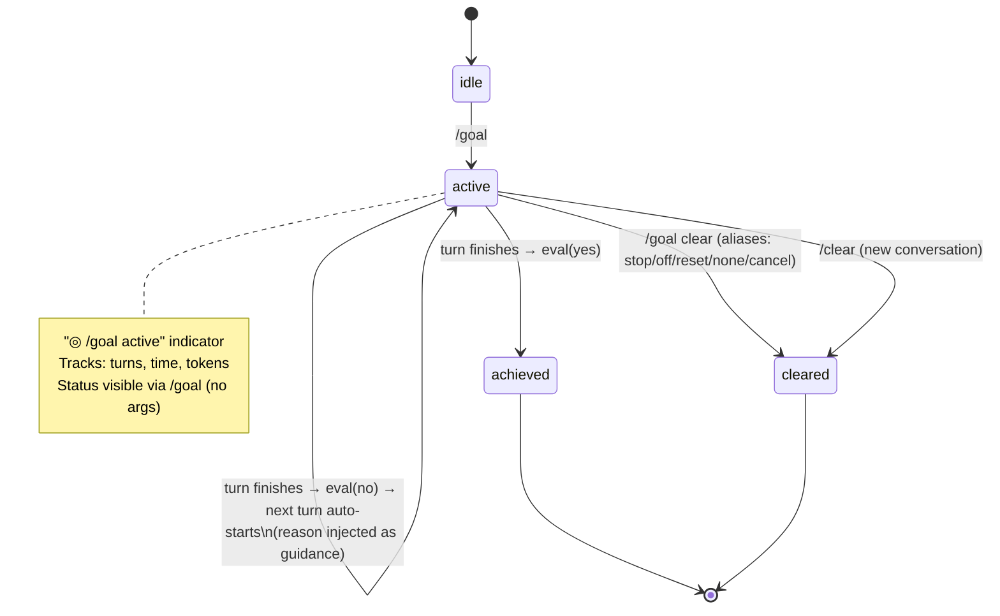
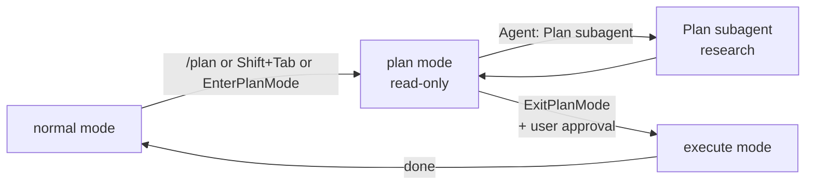
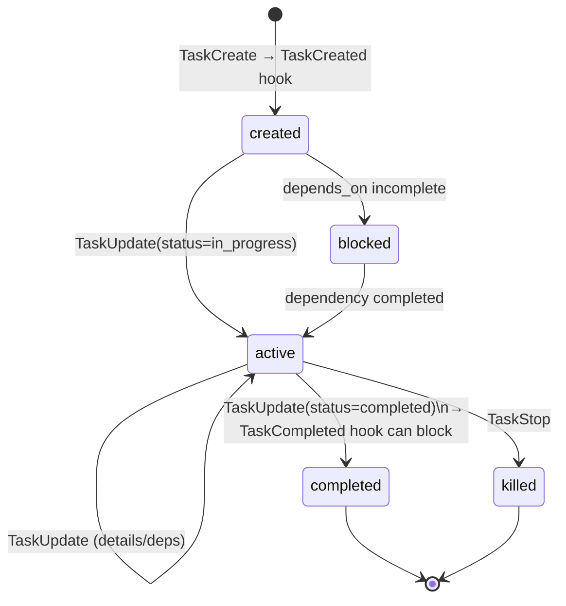

# Claude Code goal/plan tracking — digest

> Primary sources: docs.claude.com (Anthropic). All claims FACT unless noted. Citations link to entries in sources.md.

Anthropic ships **three distinct layers** in Claude Code that all touch "the goal":

1. **`/goal`** — a session-scoped durable completion condition with a model-judged Stop hook. [11]
2. **Plan mode + ExitPlanMode** — a read-only deliberation phase that produces an approvable plan. [12][14]
3. **Task tools** (`TaskCreate`/`TaskGet`/`TaskList`/`TaskUpdate`/`TaskStop`) — a structured checklist that replaces the deprecated `TodoWrite`. [12]

These compose: a `/goal` keeps the loop running between turns; plan mode designs the approach; tasks track the steps. They sit on top of a hook bus that lets external code observe and gate every transition.

---

## `/goal` — durable completion conditions (the closest analog to pi-goals) [11]

### Representation
- **Single condition string** per session (one active goal at a time). Max **4000 chars**. [11]
- The user types `/goal <condition>` and the *condition itself* becomes the first turn's directive. No separate criteria/constraints/evidence fields — everything is bundled into the condition. [11]
- Recommended structure (from docs): one measurable end state + a stated check (how Claude proves it) + constraints that must not change. [11]

### Lifecycle [11]

### Evaluator [11]
- **Prompt-based Stop hook** wrapper. After every assistant turn, the configured *small fast model* (default Haiku) receives the condition + transcript and returns yes/no + short reason.
- **"No" reasons are injected as guidance for the next turn** — this is the active-reminder mechanism, and it adapts to drift (the evaluator looks at what just happened, not a static reminder).
- Evaluator does **not** run commands or read files; it judges against what Claude has surfaced in the transcript. (REPORTED — design implication: write conditions Claude's *output* can demonstrate.)
- To bound runtime, embed a clause like "…or stop after 20 turns" in the condition.

### Persistence [11]
- Goal is session-scoped. `--resume` / `--continue` restores the active condition; **turn count, timer, and token-spend baseline reset on resume**. Achieved/cleared goals are not restored.
- `/clear` (new conversation) clears the goal.

### Surfacing [11]
- Live status indicator `◎ /goal active` showing elapsed time.
- `/goal` with no args = status view: condition + turns + time + tokens + most recent evaluator reason.
- Most recent evaluator reason also lands in the transcript.

### Non-interactive
- Works with `-p` and Remote Control. `claude -p "/goal …"` runs to completion in one invocation. Ctrl+C interrupts. [11]

### Why this beats a static reminder (SYNTHESIS)
- Reminder text in pi-goals is **the same every turn** (with a turn-repeat throttle); /goal's "reason" is **freshly generated each turn** by a separate model reading the transcript.
- Completion is decided by **a different model than the one doing the work** — sidesteps the worker's self-evaluation bias.

---

## Plan mode + ExitPlanMode — pre-execution deliberation [12][14][16]

### What it is
- A permission mode (`plan`) restricting Claude to read-only tools while it designs an approach. Enter via `Shift+Tab` cycle (default → acceptEdits → plan), `/plan`, `claude --permission-mode plan`, or `defaultMode: "plan"` in settings. [14][17]
- Tools blocked: `Write`, `Edit`, `Bash` writes — Claude can read, search, use LSP, web search. [14]

### Tools
- **`EnterPlanMode`** — switches to plan mode (model-callable). [12]
- **`ExitPlanMode`** — presents a plan for approval and exits plan mode (requires permission). Approval is the gate that returns Claude to the previous mode and lets execution proceed. [12]

### Plan subagent [16]
- During plan mode, Claude can delegate codebase research to the **Plan** subagent (read-only tools, inherits parent model). Built-in. Prevents infinite nesting (subagents cannot spawn subagents).

### Lifecycle [12][14][16]

### Durability
- Plan mode is a **permission mode**, not a stored artifact. The plan itself lives only in the conversation transcript (until /compact). To persist a plan, the user must save it as a file (docs recommend writing it down for big work).

---

## Task tools — structured checklist [12][13]

### Schema (FACT, from tool reference [12])
The Task family replaces the older `TodoWrite`:

| Tool | Purpose |
|---|---|
| `TaskCreate` | Creates a new task in the task list |
| `TaskGet` | Retrieves full details for a specific task |
| `TaskList` | Lists all tasks with their current status |
| `TaskUpdate` | Updates task status, dependencies, details, or deletes tasks |
| `TaskStop` | Kills a running background task by ID |
| `TaskOutput` | **Deprecated** — prefer Read on the task's output file path |
| `TodoWrite` | **Deprecated** in favor of TaskCreate/Get/List/Update. Interactive sessions already use Task tools by default. `claude -p` and Agent SDK still default to TodoWrite unless `CLAUDE_CODE_ENABLE_TASKS=1` |

**Critical:** `TaskUpdate` supports **dependencies**. This is structurally beyond a flat todo list — it is a small DAG (FACT [12]).

### Hook events on the task lifecycle [13]
- `TaskCreated` (input + decision control: can block creation)
- `TaskCompleted` (input + decision control: can block completion — a real **verification gate**)
- `SubagentStart` / `SubagentStop` when a task spawns a subagent

These map directly to the "verify before complete" gap in pi-goals.

### Lifecycle

> Exact status enum values are not documented in the public tools page; the doc names "current status" but the schema details require an `--init` / runtime inspection to confirm. Marking REPORTED that statuses include `in_progress` / `completed` — strongly implied by hook event names but not field-listed on docs.claude.com.

---

## Hooks — the goal-aware bus [13]

Goal-relevant hooks (all documented [13]):

| Hook | Why it matters for goal mechanics |
|---|---|
| `SessionStart`, `SessionEnd` | Persistence boundaries: load/save goal & tasks |
| `UserPromptSubmit`, `UserPromptExpansion` | Inject goal-relevant context before model sees prompt |
| `PreToolUse`, `PostToolUse`, `PostToolUseFailure`, `PostToolBatch` | Gate or react to every tool call; tie evidence collection to completion |
| `PermissionRequest`, `PermissionDenied`, `PermissionDenied (retry: true)` | Tie goal to autonomy policy |
| `SubagentStart`, `SubagentStop` | Coordinate goals across delegated work |
| `TaskCreated`, `TaskCompleted` | **Verification gates** on plan progress |
| `Stop`, `StopFailure` | Where `/goal` evaluator runs (prompt-based Stop hook) |
| `PreCompact`, `PostCompact` | Preserve goal across `/compact` |
| `InstructionsLoaded` | Reinject goal context if CLAUDE.md reloads |
| `FileChanged`, `CwdChanged` | React to environment drift |

Hook handlers may be: shell commands, HTTP endpoints, **prompt-based** (LLM-judged), or **agent-based**. Prompt and agent hooks are what `/goal` is built on. [13]

---

## Subagents and goal state [16]

- Subagents run in isolated context windows (no shared memory with parent by default).
- Built-in: `Explore` (Haiku, read-only), `Plan` (read-only, plan-mode research), `general-purpose`.
- Custom subagents declare allowed tools, permission modes, MCP scope, skills, hooks (per-subagent frontmatter), and persistent memory toggle. [16]
- "Resume subagents" + "Auto-compaction" features: long-lived subagent threads with their own compaction. [16]
- Parent goal is *not* automatically propagated; the orchestrator must include relevant goal context in the subagent task prompt. SYNTHESIS: this is a deliberate isolation choice, not an oversight.

---

## Surfacing / reminder mechanics — summary

| Mechanism | Trigger | Content |
|---|---|---|
| `◎ /goal active` indicator | Persistent in TUI while goal active | Elapsed time |
| Evaluator reason | Each Stop hook fire | Fresh model-generated explanation injected as guidance for next turn |
| Status view (`/goal`) | On demand | Condition + turns + time + tokens + last reason |
| Transcript echo | Each turn | Reason appears inline so user can see what's being worked toward |
| Task list TUI | Continuous | Open tasks rendered |
| Hooks | Configurable | Custom side-channel reminders (push, Slack, etc.) |

---

## Verification

Three independent gates Claude Code ships:
1. **`/goal` evaluator** — separate model judges the condition before the turn ends. [11]
2. **`TaskCompleted` hook with decision control** — can refuse a completion based on external evidence. [13]
3. **`ExitPlanMode` permission** — user must approve before execution starts. [12][14]

None of these exist in pi-goals.

---

## Compaction and durability [13][15]

- `PreCompact`/`PostCompact` hooks allow goal/task state to survive `/compact`.
- Scheduled tasks (`/loop`, `Cron*` tools) survive `--resume` for 7 days. [15]
- `/goal` survives `--resume` (condition only); `/clear` clears it. [11]

---

## Gaps vs pi-goals (orchestrator-facing)

| Capability | pi-goals | Claude Code |
|---|---|---|
| Durable goal | ✔ (single, persisted JSON) | ✔ (`/goal`, session-restored) |
| Sub-task decomposition | ✘ | ✔ (Task tools, DAG with deps) |
| Verification gate before completion | ✘ (text reminder only) | ✔ (separate-model evaluator + TaskCompleted hook) |
| Adaptive per-turn reminder | ✘ (static text repeated every N turns) | ✔ (fresh reason from evaluator) |
| Plan-mode (deliberate before execute) | ✘ | ✔ (read-only mode + ExitPlanMode + approval) |
| Hook bus for goal events | ✘ (event log only, no decision control) | ✔ (PreToolUse, Task*, Stop, all gateable) |
| Subagent isolation w/ goal handoff | ✘ | ✔ (per-subagent frontmatter incl. memory, hooks, skills) |
| Auto-continue toward goal | ✘ | ✔ (`/goal` keeps loop running) |
| Compaction survival | partial (file-based) | ✔ (Pre/PostCompact hooks) |

---

## Citations

[11] /goal — docs.claude.com
[12] Tools reference — docs.claude.com
[13] Hooks reference — docs.claude.com
[14] Permission modes — docs.claude.com
[15] Scheduled tasks — docs.claude.com
[16] Sub-agents — docs.claude.com
[17] Commands — docs.claude.com
