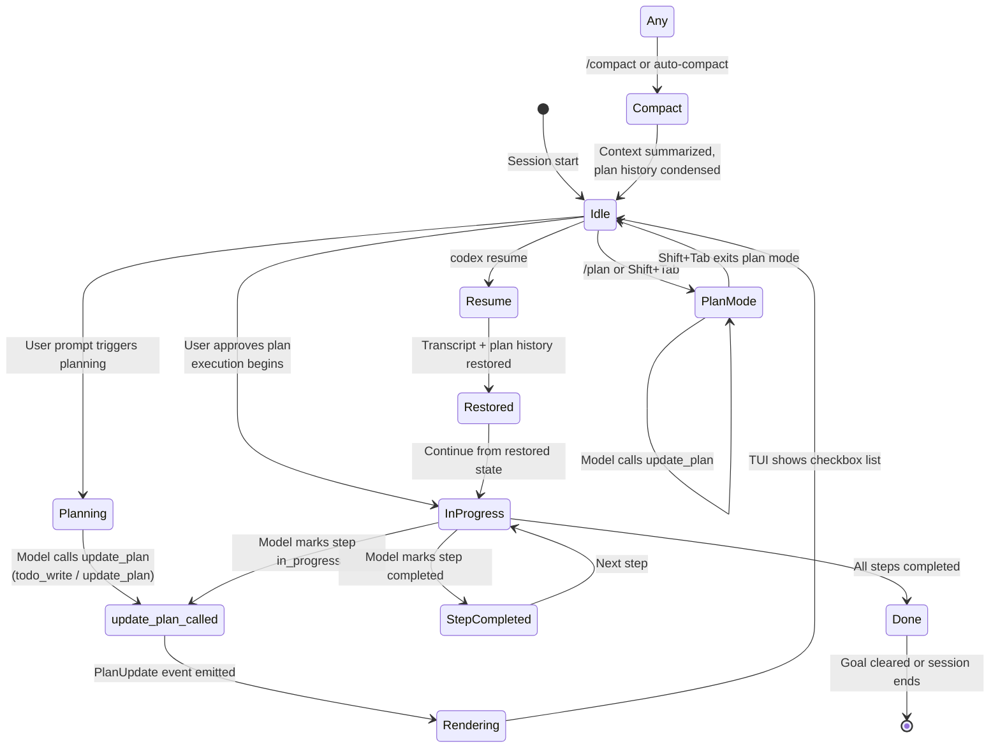

# Codex goal/plan tracking

> Research date: 2026-05-14. Sources fetched and cross-verified where possible.

---

## Representation — schema of `update_plan` / `todo_write` tool

Codex exposes a **structured checklist tool** as its primary plan-tracking primitive.

**Primary tool name:** `todo_write` (as of PR #10124, Jan 2026); `update_plan` is retained as a backward-compatible wire alias. Both names resolve to the same handler and emit the same protocol events. [1]

**Tool description** (from source):
> "Updates the task plan. The inputs to this function that are useful to clients, not the outputs, are what matter." [1]

**Arguments schema** (exact fields, from `codex-rs/protocol/src/plan_tool.rs` and `codex-rs/core/src/tools/handlers/plan.rs`):

```json
{
  "explanation": string | null,  // optional free-text rationale
  "plan": [                      // required; "the list of steps"
    {
      "step": string,            // required
      "status": "pending" | "in_progress" | "completed"  // required
    }
  ]
}
```

- `explanation` (`Option<String>`) — free-text context or rationale, not validated [1]
- `step` (`String`) — the step description [1]
- `status` (`StepStatus` enum) — one of: `pending`, `in_progress`, `completed` [1]
- `plan` is required; `explanation` is optional (default `null`) [1]

**Legacy alias:** `update_plan` is the tool name; `UpdatePlanArgs` / `PlanItemArg` / `StepStatus` are the protocol types. Newer types `UpdateTodoArgs` / `TodoItemArg` / `TodoStatus` are added with the same shapes; `plan` field in events dual-emits as `todo` for forward compatibility. [1]

**Event emitted on call:** `PlanUpdate` (app-server wire tag: `turn/plan/updated`). The event name is unchanged from the legacy naming. [1]

**Key architectural note:** The tool itself is a no-op at the model level — "this function doesn't do anything useful. However, it gives the model a structured way to record its plan that clients can read and render." [1] The value is in the structured inputs, not the return value.

---

## Persistence — state across turns vs. sessions vs. `/compact`

### Turn-level
Each `update_plan` call emits a `PlanUpdate` event that the client (TUI, IDE, app) can render as a checkbox list. The plan is part of the transcript — it appears as a tool-call message in the conversation history. [1][2]

### Session-level (in-progress)
As of issue #19749 (open, Apr 2026), **active todo state is not yet persistently tracked as session-level state**. The open issue describes the gap: "the core session does not currently treat the latest unfinished plan as active execution state." [3]

The proposed fix (reference PR) would add:
- `active_todo_list` to `SessionState`
- Store parsed `update_plan` args in session state before emitting `PlanUpdate`
- Clear active todo when plan is empty or all steps `completed`
- One-shot reminder injection via ephemeral developer message in `run_sampling_request`

**As of today:** `update_plan` is transcript-resident only. No persistent session-level todo state exists outside the rollout history. [3]

### Resume
Resume (`codex resume`) restores the original transcript including plan history. The open issue proposes that resume should also scan rollout items for the latest unfinished `update_plan` call and restore `active_todo_list`. [3]

### `/compact`
`/compact` (introduced PR #1497, Jul 2025) replaces earlier turns with a concise summary, freeing context tokens. Plan history is summarized as part of this process — it is not excluded. [4]

Latest models (GPT-5.1-codex-max and later) perform **automatic compaction** when context nears capacity. Manual `/compact` is still available in the CLI but the team has stated intent to eventually deprecate it. [4]

### Session files
Codex stores transcripts locally in `~/.codex/sessions/`. Each session file contains the full rollout including `PlanUpdate` events. [2]

---

## Surfacing — how the user/agent sees plan state mid-turn

**TUI rendering:** `PlanUpdate` events are displayed as a checkbox list (pending, in_progress, completed) with an optional explanation. [2]

**Open issue (#18920, Apr 2026):** The task list disappears from the TUI after the assistant responds when the session is idle, making it unusable as a continuously visible operational checklist. Reporter notes: "this feels like a lifecycle/rendering gap rather than a state gap." The Codex team was unable to reproduce in initial testing. [5]

**Mid-turn surfacing:** Codex shows the plan before making changes — users can "Watch Codex explain its plan before making a change, and approve or reject steps inline." [2]

**Plan Mode surfacing:** When Plan Mode is active (Shift+Tab), the composer is blocked from execution, enters read-only sandbox, and renders `update_plan` output as an iterative checklist. [2]

**Reminder injection (proposed, not yet shipped):** The reference PR for #19749 proposes injecting a one-shot ephemeral developer message reminder after `update_plan` calls and at the beginning of user turns with unfinished todos. [3]

---

## Verification — what the system does (or doesn't) to require evidence before marking done

**Codex does NOT automatically verify step completion.** The model is responsible for calling `update_plan` with `status: "completed"` after performing each step. There is no system-level enforcement that the file changed matches the step description. [1]

**Codex does NOT mark steps done automatically.** The model must explicitly invoke the tool with updated status values.

**What drives completion:**
- The model self-reports via `update_plan` tool calls
- Tests/lint/typecheck can be encoded in AGENTS.md as "done when" criteria
- `/goal` (experimental) provides a durable stopping condition but still relies on model self-assessment of completion
- The validation loop (run tests, check errors) is a human or AGENTS.md-driven convention, not a system mechanism

**Cross-verification:** No cross-verification of plan steps against actual file state is enforced by the tool. The tool is purely declarative.

---

## Autonomy / approval policy — how plan steps interact with approval modes

Codex has **two orthogonal security layers**: sandbox mode (what Codex can technically do) and approval policy (when it must pause and ask). [6]

**Approval modes** (documented at developers.openai.com/codex/agent-approvals-security):
- `on-request` (default, recommended): auto-approves operations inside the sandbox, prompts on sandbox escalation
- `unless-trusted`: always prompts; skips only for execpolicy-covered commands
- `never`: no prompts at all (auto-approves all operations within sandbox limits)
- `on-failure`: deprecated [6]

**Sandbox modes:**
- `read-only`: read files and answer questions; every edit/command requires approval
- `workspace-write` (default for trusted dirs): read + edit + run commands in working directory automatically
- `danger-full-access`: bypasses sandbox and approvals entirely [6]

**Plan step interaction:**
- Plan mode (Shift+Tab) uses a **read-only sandbox** — no edits or commands can execute regardless of approval mode [2]
- Approval modes control *execution* of planned steps, not the plan itself
- A planned step that requires a shell command still triggers the approval prompt based on the active approval policy
- There is **no plan-aware approval**: the system does not pre-authorize all steps in a plan when the user approves the plan
- Users can escalate to `full-auto` (`--sandbox workspace-write --ask-for-approval on-request`) to let Codex execute planned steps without per-step prompts [6]

**Interaction with `/goal`:** `/goal` runs an auto-continuation loop until the goal reaches `complete` or `budget_limited` (or is paused/cleared by the user). Each auto-continuation turn is still subject to the active approval policy and sandbox mode — approving a goal does NOT pre-authorize the operations the loop generates. Plan mode bypasses goal continuation entirely (see §11). [g1][g2][g4]

---

## AGENTS.md role — what AGENTS.md is expected to contain for goals; loading rules; precedence

### What AGENTS.md covers (recommended, per docs) [7]
- Repo layout and important directories
- How to run the project
- Build, test, and lint commands
- Engineering conventions and PR expectations
- **Constraints and do-not rules**
- **What "done" means and how to verify work**
- The `/init` slash command scaffolds a starter AGENTS.md

### Loading rules (hierarchical, per developers.openai.com/codex/guides/agents-md) [7]
1. **Global scope:** `~/.codex/AGENTS.override.md` if exists, else `~/.codex/AGENTS.md`. Only one file used at this level.
2. **Project scope:** Starting at the Git root, walk down to current working directory. At each directory, check `AGENTS.override.md` → `AGENTS.md` → fallback names (`TEAM_GUIDE.md`, `.agents.md` if configured). Include **at most one file per directory**.
3. **Merge order:** Concatenate from root down, joined with blank lines. Files closer to CWD override earlier guidance (appear later in the combined prompt).
4. **Size limit:** Combined size capped at `project_doc_max_bytes` (32 KiB default). Raise limit or split across nested directories.
5. **CODEX_HOME:** Can be overridden via `CODEX_HOME` env var to use a project-specific home directory.
6. **Cache:** Codex rebuilds the instruction chain on every run (and at the start of each TUI session). No manual cache clearing needed.

### Goals in AGENTS.md
AGENTS.md is the canonical place to encode **"done when"** criteria and **constraints**. For goal-oriented workflows, teams encode:
- Acceptance criteria per milestone
- Validation commands that define completion
- Stopping conditions
- Progress log format [8]

### Relationship to `/goal`
`/goal` is a SQLite-backed, runtime-enforced durable objective per thread (see §11 for full mechanics). AGENTS.md encodes *how* to verify goals and *what* "done" means; `/goal` provides the persistence, token-budget enforcement, auto-continuation loop, and a model tool surface for marking completion. The two compose: AGENTS.md drives validation, `/goal` drives the loop and stop conditions.

### Repo AGENTS.md file
The repo-level `AGENTS.md` in openai/codex itself is internal tooling guidance for the Rust codebase — it is NOT user-facing product documentation. [9]

---

## Diagram — plan lifecycle



**Legend:**
- `todo_write` / `update_plan` — the structured checklist tool (alias pair)
- `PlanUpdate` — the wire event emitted on every tool call
- `active_todo_list` — proposed session-level state (not yet shipped, #19749)
- Plan Mode (Shift+Tab) — read-only sandbox for iterative planning before execution
- `/goal` — experimental durable goal tracker (separate from `update_plan`)
- `/compact` — transcript summarization; plan history is summarized, not excluded

---

## Citations

[1] GitHub — `codex-rs/protocol/src/plan_tool.rs`, `codex-rs/core/src/tools/handlers/plan.rs`, PR #10124 (rename to todo_write) — https://github.com/openai/codex/blob/main/codex-rs/protocol/src/plan_tool.rs, https://github.com/openai/codex/blob/main/codex-rs/core/src/tools/handlers/plan.rs, https://github.com/openai/codex/pull/10124

[2] GitHub — PR #4769 (Plan Mode, Shift+Tab), docs/agents_md.md — https://github.com/openai/codex/pull/4769, https://github.com/openai/codex/blob/main/docs/agents_md.md

[3] GitHub — Issue #19749 (active_todo_list session reminders, open Apr 2026) — https://github.com/openai/codex/issues/19749

[4] GitHub — PR #1497 (/compact), Issues #4924, #11325 (auto-compact) — https://github.com/openai/codex/pull/1497, https://github.com/openai/codex/issues/4924, https://github.com/openai/codex/issues/11325

[5] GitHub — Issue #18920 (plan rendering gap after assistant response) — https://github.com/openai/codex/issues/18920

[6] OpenAI Developers — Agent approvals & security — https://developers.openai.com/codex/agent-approvals-security

[7] OpenAI Developers — Custom instructions with AGENTS.md — https://developers.openai.com/codex/guides/agents-md

[8] OpenAI Developers — Follow a goal use case — https://developers.openai.com/codex/use-cases/follow-goals

[9] GitHub — openai/codex/AGENTS.md (repo-internal, Rust tooling guidance) — https://github.com/openai/codex/blob/main/AGENTS.md

---

## Key gaps vs. naive single-goal models

| Concern | Naive single-goal model | Codex `update_plan` |
|---|---|---|
| Step-level status tracking | Implicit / manual | Structured (`pending`/`in_progress`/`completed`) but self-reported |
| Session-level persistence | Lost on new turn | Transcript-resident; not yet session-state-tracked |
| Mid-turn reminder | Relies on model recall | Proposed but not shipped (`active_todo_list` pending #19749) |
| Plan-aware approval | Pre-authorize all steps | No — each step still triggers approval individually |
| Auto-verification | External harness | None — purely declarative tool |
| Resume state | Usually lost | Transcript restored; plan state scanned but not yet enforced |
| Compact awareness | May lose plan | Plan history summarized; no special preservation |
| Visibility after assistant response | N/A | TUI rendering gap (issue #18920, open) |

**Biggest gaps:**
1. `active_todo_list` session state is not yet implemented (#19749 open) — the model must rely on transcript context to recall unfinished steps
2. Plan rendering disappears after the assistant responds (#18920 open) — cannot serve as a persistent visible checklist
3. No system-level step verification — completion is entirely self-reported
4. Approval is orthogonal to plan — approving a plan does not pre-authorize its steps

---

## Sources not fetched / gaps

- **chatgpt.com/codex** (ChatGPT cloud Codex): returned 403 Forbidden. Unable to verify environment vs. CLI differences for plans/goals. [10]
- **developers.openai.com/codex/cli/features#plan-mode**: Plan Mode section exists within the features page but was not rendered in the pruned output; details reconstructed from PR #4769 and slash commands page.
- **developers.openai.com/codex/cli/features#approval-modes**: Approval modes section not rendered in pruned output; details reconstructed from the agent-approvals-security page, exec-policy page, and external commentary.
- **GitHub releases page**: Changelog redirects to releases page; individual release notes are JavaScript-rendered and returned errors during fetch. No structured changelog for the past 12 months was obtainable.
- **`active_todo_list` implementation**: Open issue #19749 with a reference PR — not yet merged or shipped.
- **`/goal` source code**: Now covered in §11 below (was missing from original digest).

---

## §11 — `/goal` command (experimental): full mechanics

> Re-research dive 2026-05-14. The original digest treated `/goal` as REPORTED. This section is FACT-level: PR numbers, file paths, schema, and event names below are sourced from a 2026-05-09 implementation walkthrough citing exact code in the openai/codex repo (PRs #18073–#18077, ~15K LOC, landed Apr 16–25 2026 by `etraut-openai`). [g1]

### TL;DR
`/goal` is a **5-layer system** (SQLite → app-server JSON-RPC → 3 model tools → runtime event bus → TUI), gated behind `Feature::Goals` (`Stage::UnderDevelopment`, default-off). One goal per **thread**, persisted across sessions, with token + wall-clock budget accounting and an auto-continuation loop. The model can `create_goal` and `update_goal({status: "complete"})` but **cannot pause, resume, or set budget** — those transitions are system-controlled. [g1]

### Enabling the feature
- `codex features enable goals` (recommended), or add `[features] goals = true` to `~/.codex/config.toml`. [g2][g3]
- Available **CLI/TUI only** (Codex CLI 0.128.0+). NOT in the macOS app or ChatGPT web. [g3][g5]
- After enabling, the `/goal` command appears in the slash popup. [g3]

### Slash command surface
Registered as `SlashCommand::Goal` with:
- description: `"set or view the current goal for a long-running task"`
- `supports_inline_args()` → true
- `available_during_task()` → true [g1]

User-facing forms (per issue #20536 and developers.openai.com docs):
- `/goal <objective>` — set/replace the goal
- `/goal` — view current goal (status, elapsed time, tokens used / budget)
- `/goal pause` — pause active goal (user-controlled)
- `/goal resume` — resume paused goal
- `/goal clear` — delete the goal [g2][g4]

Doc-facing status labels (TUI): `pursuing`, `paused`, `achieved`, `unmet`, `budget-limited`. Map onto the backend statuses (see below). [g2]

### Layer 1 — Persistence (PR #18073)
Single SQLite table `thread_goals` (migration `0029_thread_goals.sql`), one row per thread, FK to `threads(id) ON DELETE CASCADE`. [g1]

```sql
CREATE TABLE thread_goals (
    thread_id            TEXT PRIMARY KEY NOT NULL REFERENCES threads(id) ON DELETE CASCADE,
    goal_id              TEXT NOT NULL,        -- UUID, regenerated on every replacement
    objective            TEXT NOT NULL,
    status               TEXT NOT NULL CHECK(status IN
                           ('active','paused','budget_limited','complete')),
    token_budget         INTEGER,              -- nullable; unlimited if null
    tokens_used          INTEGER NOT NULL DEFAULT 0,
    time_used_seconds    INTEGER NOT NULL DEFAULT 0,
    created_at_ms        INTEGER NOT NULL,
    updated_at_ms        INTEGER NOT NULL
);
```

**Backend statuses (4):** [g1]
- `active` — in progress; runtime accounts usage every tool completion
- `paused` — stopped by user (`/goal pause`) or `TaskAborted(Interrupted)`; no usage tracked
- `budget_limited` — terminal; in-flight usage still flushed via best-effort accounting
- `complete` — terminal; model called `update_goal({status:"complete"})`

**State runtime APIs** (`state/src/runtime/goals.rs`): `get_thread_goal`, `replace_thread_goal` (resets usage, mints new `goal_id`), `insert_thread_goal` (ON CONFLICT DO NOTHING), `update_thread_goal` (partial status/budget), `pause_active_thread_goal`, `delete_thread_goal`, `account_thread_goal_usage` (atomic time+tokens add; auto-sets `budget_limited` via SQL CASE when threshold crossed). [g1]

**Two non-obvious invariants:** [g1]
1. **Stale-update protection via `goal_id` UUID versioning.** Every replacement mints a fresh `goal_id`. All accounting writes carry an `expected_goal_id`; if it doesn't match the row's current `goal_id`, the write is silently dropped. This prevents an in-flight tool completion from clobbering a goal the user just replaced.
2. **Atomic budget enforcement.** A SQL `CASE` expression transitions `active → budget_limited` inline with the usage-update write — no separate check-and-set, no race window.

### Layer 2 — App-server JSON-RPC (PR #18074)
Three experimental methods (each gated by `#[experimental("...")]`): [g1]

| Method | Behavior |
|---|---|
| `thread/goal/set` | Create/replace/update. New `objective` ⇒ replace (resets usage). Same non-terminal `objective` + new `status`/`tokenBudget` ⇒ update (preserves usage). `tokenBudget: null` removes budget; omitting `tokenBudget` leaves it unchanged. |
| `thread/goal/get` | Returns `{goal: ThreadGoal | null}`. |
| `thread/goal/clear` | Deletes the goal; returns `{cleared: bool}`. |

Two server-push notifications: `thread/goal/updated` (any goal change, includes full `ThreadGoal` + optional `turnId`) and `thread/goal/cleared`. [g1]

`ThreadGoal` shape: `{ threadId, objective, status, tokenBudget?, tokensUsed, timeUsedSeconds, createdAt, updatedAt }`. [g1]

### Layer 3 — Model tool surface (PR #18075)
**Asymmetric**: only 3 tools, missing pause/resume/budget by design. [g1]

| Tool | Args | Behavior |
|---|---|---|
| `create_goal` | `{ objective, token_budget? }` | Fails if any goal already exists; creates new `active` row. |
| `update_goal` | `{ status: "complete" }` | Only `complete` is accepted — pause/resume/budget transitions are system-only. |
| `get_goal` | — | Returns current goal or null. |

Tool-spec guard injected into the system prompt: [g1]
> *"Create a goal only when explicitly requested by the user or system/developer instructions; do not infer goals from ordinary tasks."*

When a budgeted goal is marked complete, the tool response includes a human-readable `completionBudgetReport` like `"Goal achieved. Report final budget usage to the user: tokens used: 3250 of 10000; time used: 75 seconds."` — so the assistant naturally surfaces budget burn to the user. [g1]

### Layer 4 — Runtime event bus (PR #18076)
The lifecycle engine in `core/src/goals.rs` listens to session-level events via the `GoalRuntimeEvent` enum: [g1]

| Event | Effect |
|---|---|
| `TurnStarted` | Snapshot active `goal_id` + baseline tokens. **Plan mode skips.** |
| `ToolCompleted` | Delta-account tokens + wall-clock. May inject `budget_limiting` steering item. |
| `ToolCompletedGoal` | Same as above, but suppresses budget-limit steering (avoids double-report on the same turn the goal got marked complete). |
| `TurnFinished` | Final accounting; activates no-tool continuation suppression. |
| `TaskAborted(Interrupted)` | Auto-pauses active goal. |
| `ThreadResumed` | Reactivates paused goal (`paused → active`). |
| `MaybeContinueIfIdle` | Starts auto-continuation turn using `continuation.md` prompt. |
| `ExternalMutationStarting` | Best-effort accounting flush before an external set/clear. |
| `ExternalSet { status }` | Apply external status; `active` ⇒ maybe-continue, `budget_limited` ⇒ clear runtime state. |
| `ExternalClear` | Drop runtime accounting state for the cleared goal. |

**Accounting model:** two per-thread snapshots — `GoalTurnAccountingSnapshot` (token deltas per turn) and `GoalWallClockAccountingSnapshot` (real elapsed time). Updates serialized via `Semaphore(1)`. Deltas (`current − last_accounted`) are pushed to SQLite atomically. [g1]

**Budget-limit steering:** when accounting crosses `token_budget`, the runtime injects a `budget_limiting` content item directly into the model's response stream (i.e. the model sees a system-style steering message at the next turn). Suppressed on the completion turn and on subsequent tool completions in the same goal (`budget_limit_reported_goal_id` flag). [g1]

**Auto-continuation:** after `TurnFinished` or `ThreadResumed`, if the goal is `active` and the thread is idle, the runtime fires one continuation turn with the `continuation.md` prompt (`"Continue working toward your goal: {objective}..."`). [g1]

Stop conditions (the loop is **one-shot per trigger**, not a self-firing infinite loop): [g1]
1. Goal is in a terminal status (`complete` or `budget_limited`).
2. **No-tool suppression** — if the prior continuation turn produced zero tool calls, `continuation_suppressed = true`. User action, real tool calls, or external mutations reset it.
3. **`Semaphore(1)` guard** — only one continuation in-flight at a time; concurrent triggers bail.
4. **Plan mode bypass** — plan-mode turns ignore goal events entirely (no continuation, no accounting).
5. **Idle guard** — `maybe_continue_goal_if_idle` no-ops if the thread already has an active turn.

### Layer 5 — TUI UX (PR #18077)
- Slash command popup entry (above). [g1]
- `chatwidget.rs` goal connector subscribes to `thread/goal/updated` / `thread/goal/cleared` and renders objective + status + elapsed time + tokens-used in the status bar. [g1]
- Continuation prompts live as templates in `templates/goals/` (`continuation.md`, `budget_limit.md`). [g1]
- **Resume ordering on `codex resume`:** (1) emit goal snapshot notification, (2) apply runtime effects (paused → active), (3) send resume response + replay transcript, (4) maybe-continue if idle. [g1]

### Macro lifecycle (FSM)
```
created ─(active)──────────────────────┐
   │                                   │
   │  TaskAborted / /goal pause        │
   ▼                                   │
 paused ──(ThreadResumed | /goal resume)┤
                                       │
   tokens_used ≥ token_budget          │
   ───────────► budget_limited (term.) │
                                       │
   model: update_goal(complete)        │
   ───────────► complete (terminal) ◄──┘
   user: /goal clear / thread delete
   ───────────► <row removed>
```

### How `/goal` compares with `update_plan` / `todo_write`
| Aspect | `/goal` (§11) | `update_plan` / `todo_write` (§1–§3) |
|---|---|---|
| Granularity | One durable objective per thread | List of fine-grained steps |
| Persistence | SQLite row, survives compaction | Transcript-resident only (#19749 still open) |
| Control surface | User + system + 3 model tools | Model tool only |
| Budget enforcement | First-class (`token_budget`, SQL-atomic) | None |
| Auto-continuation | Yes (`MaybeContinueIfIdle`) | No |
| Verification | None at system level (model self-attests `complete`) | None (purely declarative) |
| Plan-mode behavior | Bypassed (no continuation, no accounting) | Plan mode runs `update_plan` iteratively |

### Implications for pi-charter
Codex `/goal` is now a strong reference for several Tier-A/B recommendations the previous report only sourced from Claude Code:
- **Goal-ID versioning for stale-write protection** — directly applicable to pi-goals' JSON-file model (write a per-revision UUID, drop accounting writes from stale revisions).
- **Token + wall-clock budget enforced atomically** — pi-goals has no budget concept; Codex makes a strong case for one.
- **Auto-pause on interrupt + auto-resume on session re-entry** — pi-goals only persists status; auto-transitions are a free upgrade.
- **Auto-continuation loop with no-tool suppression** — only valuable when pi-goals can also drive a turn boundary; tracker dependent.
- **Status-bar surface (objective + elapsed + tokens)** — pi-goals' static reminder is strictly worse than a live UI affordance.
- **Narrow, state-filtered tool surface** — model-facing tools should remain grouped and guided by `nextActions[]`; user/system controls rebind/clear/budget-sensitive operations. This is sharper than v1 pi-goals' broad symmetric `goal_manage` action surface.

### Citations (this section only)
- [g1] How OpenAI Codex implements the `/goal` slash command — `patleeman` GitHub gist, 2026-05-09. Cites PRs #18073/#18074/#18075/#18076/#18077, files `state/src/runtime/goals.rs`, `core/src/goals.rs`, migration `0029_thread_goals.sql`, `templates/goals/continuation.md`, `templates/goals/budget_limit.md`. https://gist.github.com/patleeman/b1b5768393f9bf2f60865b1defeeb819
- [g2] OpenAI Developers — Slash commands in Codex CLI / "Follow a goal" use case. https://developers.openai.com/codex/guides/slash-commands/ , https://developers.openai.com/codex/use-cases/follow-goals
- [g3] mehmetbaykar.com — "Codex CLI /goal: Enable the Ralph Loop" (2026-05-08). https://mehmetbaykar.com/posts/enable-goal-mode-in-codex-cli/
- [g4] GitHub Issue #20536 — Document /goal CLI command and Goals lifecycle (status labels: pursuing/paused/achieved/unmet/budget-limited; verified against 0.128.0). https://github.com/openai/codex/issues/20536
- [g5] GitHub Issue #22049 — macOS app should natively support /goal (confirms CLI-only). https://github.com/openai/codex/issues/22049
- [g6] GitHub Issue #20591 — `/goal` slash command does not work in 0.128.0 (workaround: enable feature flag). https://github.com/openai/codex/issues/20591
