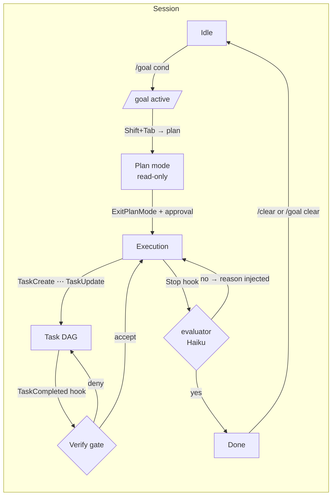
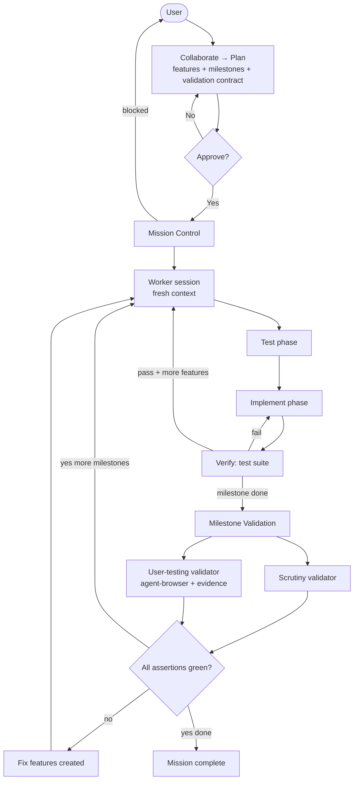

# Goal/Mission Tracking — A Cross-Agent Comparison

> **Date:** 2026-05-14
> **Scope:** OpenAI Codex CLI · Anthropic Claude Code · Factory Droid Missions vs. local v1 `pi-goals` and the planned `pi-charter` successor
> **Audience:** designer of `pi-charter`

---

## Executive Summary

`pi-goals` today is a **single durable text reminder** with no decomposition, no verification gate, no autonomy coupling, and no adaptive surfacing. Every comparable system has moved past this shape:

- **Codex** ships *two* primitives. `todo_write`/`update_plan` covers structured step arrays (`pending|in_progress|completed`, still transcript-resident — open issue #19749 proposes the session-state layer pi-goals already has). **`/goal` (experimental, now FACT-level)** is a 5-layer SQLite-backed durable objective per thread with token+wall-clock budget enforcement, asymmetric model tools (`create_goal` / `update_goal(complete)` / `get_goal` — model cannot pause/resume/budget), an auto-continuation loop with no-tool suppression, `goal_id` UUID stale-write protection, and plan-mode bypass. Codex's other lead is the **AGENTS.md hierarchy** that encodes "what done means".
- **Claude Code** ships the most complete stack: `/goal` (durable condition + *separate-model* evaluator built on a prompt-based Stop hook), `ExitPlanMode` (deliberation gate), the full `Task*` tool family (DAG with dependencies, replacing the deprecated `TodoWrite`), and a goal-aware hook bus (`TaskCreated`, `TaskCompleted`, `SubagentStop`, `PreCompact`).
- **Factory Droid Missions** is the most ambitious: missions are **multi-session orchestrated workflows** with a written `validation-contract.md` (FACT, [F1]), TDD-per-feature workers, **scrutiny + black-box validators**, fix-feature loops, and Mission Control as the surfacing layer. Verification is mandatory and evidenced (screenshots, network traces). Requires High autonomy.

**The capability ranking on every axis we measured:** Factory Droid ≥ Claude Code ≳ Codex ≫ pi-goals. (Codex's standing moved up materially once `/goal` source mechanics were uncovered — it now beats Claude `/goal` on **budget enforcement** and **persistence**, while Claude still wins on **adaptive surfacing** via the cheap-model evaluator and on **decomposition** via the Task DAG.)

**The single highest-leverage upgrade path:** replace v1 `pi-goals` with **pi-charter** — a charter-scoped post-turn evaluator plus a criteria-backed completion gate and macro DAG. The original single-step recommendation (post-turn evaluator) remains the first slice, but the target design is now a renamed successor, not a v1 patch.

Confidence: **High** on Claude Code and Codex (primary docs + source). **Medium-High** on Factory Droid (docs are public but some internals reconstructed from engineering blog + third-party analysis).

---

## Research Questions

1. How does Codex represent, persist, surface, and verify a goal/plan?
2. How does Claude Code structure goals/plans/todos across `/goal`, plan mode, and the Task tools?
3. What are Factory Droid Missions: lifecycle, autonomy, verification, persistence?
4. Where does `pi-goals` lag, and which gaps are highest leverage to close?
5. What concrete v2 design would compete without bloating the extension?

---

## 1. pi-goals — baseline (FACT, from source [P1])

Single TypeScript extension at `agent/extensions/pi-goals/index.ts`.

**Representation.** One `GoalState` object: `id`, `objective`, `status: active|paused|completed`, `criteria[]`, `constraints[]`, `nextAction?`, `evidence[]`, `risks[]`, `completionNote?`, timestamps, `turnsActive`. One goal at a time; `create` overwrites.

**Persistence.** Atomic temp+rename JSON at `<cwd>/.pi/goals/goal-<sessionId>.json` (or `PI_GOALS` override). Survives session restart by virtue of being on disk.

**Surfacing.** One persistent reminder via `reminder:upsert` (id `active-goal`, priority 30, `repeatEveryTurns: 8`, `display: false`). **Text is identical every emission** — just objective + first 3 criteria + first 3 constraints + nextAction + a static "verify before complete" nudge.

**Verification.** None. The model self-asserts completion in the `goal_manage complete` call. Optional `evidence[]` / `risks[]` arrays exist but no external check confirms them.

**Autonomy coupling.** None. Goal state has no relationship to approval modes, sandbox, or tool gating.

**Decomposition.** None. Criteria are a flat string array, not tasks; there is no dependency layer.

**Compaction/handoff.** Survives `/compact` because state is on disk, but no goal context is reinjected after compaction; no integration with subagents.

---

## 2. Codex — `update_plan` / `todo_write` + Plan Mode + AGENTS.md [C1–C9]

### Representation
A typed step list (FACT [C1]):
```ts
{
  explanation: string | null,
  plan: Array<{ step: string, status: "pending" | "in_progress" | "completed" }>
}
```
Tool name: `todo_write` since PR #10124 (Jan 2026); `update_plan` retained as wire alias. Both emit a `PlanUpdate` event (wire tag `turn/plan/updated`). The tool is a **no-op at the model level** — its only job is to give the model a structured way to record intent that clients can render. [C1]

### Plan Mode (Shift+Tab) [C2]
A separate **read-only sandbox** for iterative planning before execution. Edits/commands blocked regardless of approval policy. Plan iteration ends when user toggles back out; the plan itself lives only in the transcript.

### Persistence — the gap
Session-level "active todo list" is **not yet shipped** (open issue #19749, Apr 2026). Today plans are transcript-resident; on `/compact` they get summarized like any other turn. Issue #18920 separately reports the TUI rendering disappears after the assistant responds (still open). [C3][C5]

### Autonomy
Three sandbox modes (read-only / workspace-write / danger-full-access) × three approval policies (on-request / unless-trusted / never). Plan steps are **not pre-authorized by plan approval** — each operation re-enters approval. [C6]

### AGENTS.md — the design that pi-goals should steal [C7]
Hierarchical load order: global (`~/.codex/AGENTS.override.md` → `~/.codex/AGENTS.md`) → from git root walking down to CWD (with `AGENTS.override.md` precedence at each directory). Concatenated root-down (closer-to-CWD overrides earlier). 32 KiB cap (`project_doc_max_bytes`). `CODEX_HOME` override. Rebuilt every run; no manual cache management. **The canonical place to encode "what done means" and validation commands.**

### `/goal` (experimental) — FACT-level [g1–g6]
A **5-layer system** behind `Feature::Goals` (default-off; enable with `codex features enable goals` or `[features] goals = true`). CLI/TUI-only as of 0.130.0 [g5]; absent from macOS app and ChatGPT web.

**Layer 1 — SQLite persistence.** Single `thread_goals` row per thread (one goal per thread, FK to `threads(id) ON DELETE CASCADE`). Columns: `goal_id` UUID, `objective`, `status ∈ {active, paused, budget_limited, complete}`, optional `token_budget`, running `tokens_used` / `time_used_seconds`, timestamps. Stale-write protection: every replacement mints a new `goal_id`; writes carrying a mismatched `expected_goal_id` are silently dropped. Budget transitions are atomic via SQL `CASE` (no check-and-set race). Migration `0029_thread_goals.sql`; state APIs in `state/src/runtime/goals.rs`. [g1]

**Layer 2 — App-server JSON-RPC.** `thread/goal/set` (create/replace/update with reset-vs-preserve semantics keyed on objective equality), `thread/goal/get`, `thread/goal/clear`; server-push notifications `thread/goal/updated` and `thread/goal/cleared`. All `#[experimental]`. [g1]

**Layer 3 — Model tools (asymmetric by design).** `create_goal{objective, token_budget?}` (fails if a goal exists), `update_goal{status:"complete"}` (only terminal transition the model can make), `get_goal`. Pause/resume/budget transitions are **system-only** — the model cannot self-pause or extend its own budget. Tool spec includes a guard: *"Create a goal only when explicitly requested by the user or system/developer instructions."* Completing a budgeted goal returns a `completionBudgetReport` string so the assistant surfaces usage to the user. [g1]

**Layer 4 — Runtime event bus (`core/src/goals.rs`).** `GoalRuntimeEvent` enum: `TurnStarted` (snapshot baseline, skip in plan mode), `ToolCompleted`/`ToolCompletedGoal` (delta-account tokens + wall-clock, inject `budget_limiting` steering item if threshold crossed), `TurnFinished`, `TaskAborted(Interrupted)` (auto-pause), `ThreadResumed` (auto-resume `paused → active`), `MaybeContinueIfIdle` (fire one continuation turn using `templates/goals/continuation.md`), `ExternalMutationStarting`/`ExternalSet{status}`/`ExternalClear`. Accounting serialized via `Semaphore(1)`. Auto-continuation is **one-shot per trigger** with no-tool suppression — prevents stubborn loops. [g1]

**Layer 5 — TUI UX.** Slash command (`supports_inline_args` + `available_during_task`), status-bar connector showing objective + elapsed + tokens, subcommands `set/view/pause/resume/clear`. TUI status labels: `pursuing/paused/achieved/unmet/budget-limited`. [g1][g4]

**Verification stance.** Still model-self-attested: the model decides when to call `update_goal({status:"complete"})`; the runtime does not require evidence. But budget enforcement is real and atomic — `budget_limited` is system-decided, not model-decided.

**Interaction with Plan Mode.** Plan-mode turns ignore goal events entirely (no accounting, no continuation). Goal continuation is suspended for the duration of plan mode. [g1]

### Lifecycle

```mermaid
stateDiagram-v2
    direction LR
    [*] --> Idle
    Idle --> PlanMode: Shift+Tab or slash plan
    PlanMode --> PlanMode: model calls update_plan -- read-only
    PlanMode --> Idle: Shift+Tab exits
    Idle --> Executing: user prompt
    Executing --> Executing: update_plan -- step in_progress
    Executing --> Done: update_plan -- last step completed
    Executing --> Approval: tool requires approval
    Approval --> Executing: user approves
    Done --> [*]
    Idle --> Resume: codex resume -- transcript restored; active_todo_list pending 19749
    Resume --> Executing
```


### Verdict
For *plans* (`update_plan` / `todo_write`): Codex is **slightly ahead of pi-goals on step typing** but **even on session-level persistence** (Codex literally has an open issue to add what pi-goals has). For *goals* (`/goal`): Codex is **substantially ahead of pi-goals** on persistence (SQLite vs. flat JSON), budget enforcement (atomic SQL CASE), autonomy (auto-continuation loop with no-tool suppression), safety (asymmetric tool surface — model can't pause/resume/extend-budget), and resume semantics (auto-resume on thread re-entry, auto-pause on interrupt). Codex is **clearly ahead on AGENTS.md** as a contract for "done." Codex still lacks Claude Code's **separate-model evaluator** (no fresh post-turn reason; the continuation prompt is templated) and **subagent goal propagation**.

---

## 3. Claude Code — `/goal` + Plan mode + Task tools + Hooks [CC11–CC17]

### `/goal` — durable conditions with a separate-model evaluator [CC11]
- **One condition per session**, ≤4000 chars; condition itself doubles as the turn directive.
- After **every assistant turn**, a **separate small fast model** (default Haiku) reads the condition + transcript and returns yes/no + a fresh **reason**. A "no" auto-starts the next turn and **injects the reason as guidance**. A "yes" clears the goal and records an achievement.
- Built on a **prompt-based Stop hook** — `/goal` is sugar over the hook system, so users can replicate it with their own hooks.
- `◎ /goal active` indicator (elapsed time); `/goal` (no args) shows full status (turns, time, tokens, last reason). Restored on `--resume` (condition only; counters reset). `/clear` removes it.
- Works headless: `claude -p "/goal …"` runs to completion.

### Plan mode + ExitPlanMode [CC12][CC14][CC16]
- **Permission mode** restricting Claude to read-only tools. Entered via Shift+Tab cycle, `/plan`, `--permission-mode plan`, or `defaultMode`. The model uses `EnterPlanMode` to enter and `ExitPlanMode` (requires user approval) to leave with a presentable plan.
- During plan mode, codebase research is delegated to the built-in **Plan subagent** (read-only, inherits parent model). Subagents cannot spawn subagents.

### Task tools — DAG-shaped checklist [CC12]
**`TodoWrite` is deprecated.** Interactive sessions default to the new Task tools; `claude -p` / Agent SDK still default to `TodoWrite` unless `CLAUDE_CODE_ENABLE_TASKS=1`.

| Tool | Purpose |
|---|---|
| `TaskCreate` | New task |
| `TaskGet` | Full details for one task |
| `TaskList` | All tasks + status |
| `TaskUpdate` | Status, **dependencies**, details, delete |
| `TaskStop` | Kill a running background task |

The presence of dependencies makes this a **task DAG**, not a flat list. Task lifecycle events fire as **hooks**.

### Hook bus — every transition is gateable [CC13]
Hooks relevant to goal mechanics: `SessionStart/End`, `UserPromptSubmit`, `PreToolUse/PostToolUse/PostToolUseFailure/PostToolBatch`, `PermissionRequest/Denied`, `SubagentStart/Stop`, **`TaskCreated`/`TaskCompleted`** (both gateable), `Stop`/`StopFailure`, **`PreCompact`/`PostCompact`**, `InstructionsLoaded`, `FileChanged`. Handlers can be shell, HTTP, **prompt-based** (LLM-judged), or **agent-based**.

### Composite lifecycle


### Verdict
The strongest of the three reference systems for **single-session** durability and **per-turn adaptive reminding**. Where it stops short: Claude Code does **not** ship a multi-session orchestrator like Factory's Missions — heavy multi-feature work needs `/batch` + worktrees rather than a structured mission spec.

---

## 4. Factory Droid Missions — multi-session orchestrated workflows [F1–F21]

### Mission ≠ session
A **Mission** is a multi-session autonomous workflow (median ~2 h, up to 16 d) for work that would dilute a single session's context. Entered via `/missions` or `/enter-mission`. Requires **High autonomy**.

### Lifecycle [F1][F2][F3]
1. **Collaborate** — Droid clarifies scope with user.
2. **Build plan** — features + milestones + skills.
3. **Plan approval** — user gates entry into automation.
4. **Mission Control** — orchestration view; user becomes PM.
5. **Per feature (worker)**: TDD loop — Test → Implement → Verify.
6. **Per milestone**: **Scrutiny validator** (quality + trajectory) + **User-testing validator** (black-box UI exercise, evidence captured).
7. **Fix loop** — orchestrator creates fix features for gaps → re-execute → re-validate.
8. Repeat per milestone; mission completes when all milestones validate green.

Total worker invocations ≈ `#features + 2 × #milestones` (floor; fix loops add more).

### Spec artifacts [F1][F2]
- `validation-contract.md` — **the finite checklist of behavioral assertions that defines success.** Each assertion: ID, description, tool to use (e.g. `agent-browser`), evidence type (screenshot, network trace).
- `features.json` — bounded work units claiming which assertions they fulfill.
- `services.yaml`, `AGENTS.md`, skill library — shared state read by all workers.

### Persistence — git as backbone [F1][F2]
No single agent holds the full picture in context. State is **externalized** to files + git commits; orchestrator delegates deep investigation to subagents so it doesn't burn its own context. Mission can pause and resume; orchestrator re-assesses state.

### Verification — mandatory and evidenced [F1][F2][F15]
- **Per feature**: test suite must pass (`pnpm test`, `pytest -q`, etc.).
- **Per milestone**: scrutiny review + black-box exercise via `agent-browser`/Droid Control (`/verify`, `/qa-test`). Screenshots, network traces, step-level pass/fail captured.

### Diagram


### Verdict
This is the **post-single-session** model of agent goals. The validation-contract pattern is portable to any system; the rest (multi-session orchestration, validator droids, fix loops) is a heavier swing than `pi-goals` should attempt in v2 but defines the ceiling.

---

## 5. Cross-System Comparison

### Goal/plan representation

| Axis | pi-goals | Codex | Claude Code | Factory Droid |
|---|---|---|---|---|
| Primary unit | one objective + flat criteria | array of typed steps | `/goal` condition + DAG of tasks | mission spec + features + milestones |
| Status enum | `active/paused/completed` (goal) | per-step `pending/in_progress/completed` | per-task (Task tools + dependencies) | per-feature; per-milestone; per-assertion |
| Decomposition | none | flat array | DAG (deps in `TaskUpdate`) | DAG: milestones → features → assertions |
| Active count | 1 goal | 1 plan (transcript) | 1 `/goal` + many tasks | 1 mission + many features |
| Schema source | TypeScript source [P1] | Rust source [C1] | docs.claude.com [CC12] | factory docs + blog [F1][F2] |

### Persistence

| Axis | pi-goals | Codex | Claude Code | Factory Droid |
|---|---|---|---|---|
| On-disk durable state | ✔ JSON | ✘ (transcript only; #19749 open) | ✔ session-restored | ✔ git + state files |
| Survives `/compact` | ✔ (file) | partial (summarized) | ✔ (PreCompact/PostCompact hooks) | n/a — externalized |
| Survives session restart | ✔ (file) | ✔ resume | ✔ `--resume` | ✔ mission resume |

### Surfacing / reminder

| Axis | pi-goals | Codex | Claude Code | Factory Droid |
|---|---|---|---|---|
| Reminder content | static text, repeated every 8 turns | TUI checkbox list | adaptive per-turn evaluator reason | Mission Control (dashboard) |
| Adaptive to drift | ✘ | partial (model sees plan in transcript) | ✔ (fresh reason each turn) | ✔ (validators check per milestone) |
| Status surface | UI status string | TUI; render gap (#18920) | `◎ /goal active` + status view | Mission Control with per-worker tokens |

### Verification

| Axis | pi-goals | Codex | Claude Code | Factory Droid |
|---|---|---|---|---|
| Completion gate | self-report only | self-report (`status: completed`) | **separate-model evaluator** + `TaskCompleted` hook can block | **mandatory** validation contract + scrutiny + black-box |
| Evidence layer | optional string list | none enforced | hook-driven custom evidence | screenshots, network traces, test runs |
| Decoupled judge | ✘ | ✘ | ✔ (Haiku evaluator separate from worker) | ✔ (validator droids ≠ worker droids) |

### Autonomy coupling

| Axis | pi-goals | Codex | Claude Code | Factory Droid |
|---|---|---|---|---|
| Plan-aware permissions | ✘ | ✘ (orthogonal) | partial (plan mode = read-only) | ✔ (mission requires High) |
| Pre-authorize approved plan | ✘ | ✘ | ✘ | ✔ (workers run autonomously inside mission) |
| Read-only deliberation mode | ✘ | ✔ Plan Mode | ✔ Plan mode | ✔ Planning phase |

### Hook / extension surface

| Axis | pi-goals | Codex | Claude Code | Factory Droid |
|---|---|---|---|---|
| Goal/task event bus | append-only log only | `PlanUpdate` wire event | full hook bus (Task*/Stop/PreCompact/etc.) | mission state changes via shared files |
| Decision-control hooks | ✘ | ✘ | ✔ (block create/complete/permission) | n/a (orchestrator-mediated) |
| Sub-/parallel-agent handoff | ✘ | n/a | ✔ Task subagents, SubagentStop hooks | ✔ worker + validator droids |

### Summary radar (qualitative score 0–4)

```mermaid
%%{init: {'theme':'default'} }%%
xychart-beta
    title "Capability score (0=missing, 4=mature)"
    x-axis [Representation, Persistence, Surfacing, Verification, Autonomy, "Sub-agents", Hooks]
    y-axis "Score" 0 --> 4
    bar "pi-goals" [1, 3, 1, 0, 0, 0, 1]
    bar "Codex" [3, 4, 3, 1, 4, 2, 1]
    bar "Claude Code" [4, 4, 4, 3, 3, 4, 4]
    bar "Factory Droid" [4, 4, 4, 4, 4, 4, 3]
```


> Scoring is SYNTHESIS based on the digests; treat as relative not absolute.

---

## 6. Gaps in pi-goals — ranked by leverage

### Tier S — biggest single-shot wins

**S1. Adaptive post-turn evaluator** (model from `/goal` [CC11]).
Replace the static reminder text with a hook-style "after every assistant turn, run a cheap model that judges: are we done? if not, which criterion is next-most-uncovered? what should the agent do next?" Then inject the *fresh* answer as the next-turn reminder. This solves three problems at once: static-text drift, no completion gate, no auto-continue. Implementable as a thin layer that calls a configurable cheap model with the goal + recent turn excerpt.

**S2. Verification gates with evidence binding** (model from Factory `validation-contract.md` [F1] + Claude `TaskCompleted` hook [CC13]).
Add `verifyCommand?: string` and/or `verifyPrompt?: string` to each criterion. Block `charter_manage({action: 'complete'})` unless every criterion has either (a) a successful `verifyCommand` execution recorded, or (b) a prompt-evaluator pass. Store the results in per-feature evidence records.

### Tier A — high leverage, moderate complexity

**A1. Sub-goal/task layer with dependencies** (model from Claude `TaskCreate/TaskUpdate` [CC12]).
Add a flat `tasks[]` array under the goal, each task with `id/title/status/dependsOn[]/verifyCommand?`. Even without a UI, this unlocks dependency-aware "what's next" computation for S1.

**A2. Goal-aware hook events** (model from Claude hooks [CC13]).
Emit `pi-goal:created/updated/criterion-completed/blocked/completed` on the existing event bus *with decision control* — let other extensions/hooks veto a completion. The append-only entry log is already there; add the gateable layer.

**A3. Compaction-aware reinjection** (model from Claude `PreCompact`/`PostCompact` [CC13]).
On compaction, write a condensed goal block back into context so the post-compact agent does not lose the criteria.

### Tier B — useful, lower urgency

**B1. Plan-mode coupling.** When a plan/read-only mode is active, refuse goal-completion attempts; allow criterion proposals.

**B2. Subagent handoff envelope.** When a subagent is spawned, include `goal.objective + relevant criteria + nextAction` in the task prompt automatically (configurable allowlist).

**B3. AGENTS.md / charter.md hierarchy.** Mirror Codex's load order for project instructions, while per-charter "what done means" lives in `charter.md §Criteria` so it doesn't have to be rewritten each session.

**B5. Token + wall-clock budget enforcement (NEW, from Codex [g1]).** Add optional `token_budget` and `time_budget_seconds` to GoalState; track `tokens_used`/`time_used_seconds`; transition `active → budget_limited` atomically when threshold crossed. Inject a one-shot "approaching budget" reminder, then a terminal one.

**B6. `goal_id` UUID versioning (NEW, from Codex [g1]).** Mint a fresh UUID on every `create` / objective-changing `update`. Accounting writes carry `expected_goal_id`; mismatches are silently dropped. Trivial to retrofit and closes a latent race between in-flight accounting and user-initiated replacement.

**B7. Tool surface safety (NEW, from Codex [g1]).** Keep the agent surface narrow and state-filtered: four grouped tools (`charter_manage`, `charter_plan`, `charter_record`, `charter_status`) with `nextActions[]` on every return; user/system controls rebind/clear/budget-sensitive operations.

**B8. Auto-pause on interrupt + auto-resume on session re-entry (NEW, from Codex [g1]).** When a turn is aborted, transition the active goal to `paused`. On session resume, reactivate. Free with a hook into existing session lifecycle events.

**B4. Resume reset semantics.** Like Claude `/goal`, keep the condition but reset turn/time/token counters on `--resume` to avoid stale watermarks.

### Tier C — explicit non-goals for v2

- Multi-session orchestrated mission runner (Factory's wheelhouse; out of scope for a local extension).
- Black-box UI validators / `agent-browser` evidence capture (requires a heavier harness).
- Built-in plan-mode permission gating (host responsibility, not extension's).

---

## 7. Recommended `pi-charter` shape (SYNTHESIS)

```mermaid
flowchart LR
    subgraph "Goal kernel"
      G["GoalState\nobjective\nstatus\nverify policy"]
      C["criteria[]\n+ verify: cmd | prompt"]
      T["tasks[] DAG\nid/title/status/dependsOn"]
      E["evidence[] (timestamped)"]
    end
    G --> C
    G --> T
    C --> E
    T --> E

    subgraph "Surfacing"
      R[reminder bus]
      EV[post-turn evaluator\ncheap model]
      EV --> R
      EV --> NEXT[nextAction suggestion]
    end

    subgraph "Verification"
      VC[verify command runner]
      VP[verify prompt judge]
      H[TaskCompleted-style hook\nwith decision control]
      VC --> E
      VP --> E
      H --> E
    end

    subgraph "Persistence"
      D[JSON file]
      RC[PreCompact reinjection]
      RES[--resume restore\n(reset counters)]
    end

    C -. cycle .-> EV
    T -. blocked? .-> EV
    EV -. ask .-> H
```

Minimal new pieces:
1. `evaluator` module (cheap model client + transcript-tail extractor).
2. `verify` module (exec runner + prompt judge), bound to existing `evidence[]`.
3. Optional `tasks[]` array on `GoalState` with deps.
4. Two new hook events with veto: `pi-goal:before-complete`, `pi-goal:criterion-ready-to-mark`.

Total surface: probably ~600 LoC additional in `index.ts` + one small evaluator file. No new persistence format — extend the existing JSON schema with optional fields, so old goal files still load.

---

## 8. Conflicting Information and Confidence

- **Codex `/goal` mechanics:** Now FACT-level — sourced from a 2026-05-09 implementation walkthrough citing PRs #18073-#18077 and exact file paths (`state/src/runtime/goals.rs`, `core/src/goals.rs`, migration `0029_thread_goals.sql`). [g1] Earlier draft of this report marked these REPORTED; corrected on re-research.
- **Claude `Task*` schema:** The tool reference lists the names but does not enumerate field types or status enum values. Status set is inferred from hook names (`TaskCreated`, `TaskCompleted`) and the deprecated TodoWrite shape. Treat field-level claims as **REPORTED**.
- **Codex `active_todo_list`:** The proposed PR for #19749 is **not yet merged** as of fetch time — claims about session-state reminder injection are **REPORTED-PROPOSED**.
- **Factory mission internals:** docs.factory.ai + engineering blog cover the major shape, but exact runner internals (e.g. how features pick which assertions they claim to fulfill) come from the engineering blog and one third-party deep dive; treat as **REPORTED-CROSS-VERIFIED**.
- **Codex TUI rendering gap (#18920):** Reporter and Codex team disagree on reproducibility. Conservative: **REPORTED**, still open.

Overall confidence: **High** on pi-goals (we own the code), Claude Code, and Codex. **Medium-High** on Factory Droid.

---

## 9. Information Gaps

- ChatGPT Codex cloud (chatgpt.com/codex) returned 403; CLI vs. cloud differences for plan/goal mechanics unverified.
- Claude `Task*` precise field schema not in public docs (status values, dependsOn field name); a follow-up could capture them via `claude -p --debug` once available.
- Factory mission runner source is not public; internals come from blog + docs.
- No empirical data on how often Claude `/goal` correctly judges completion in adversarial cases (would need a benchmark run).

---

## 10. Suggested Follow-ups

1. Prototype the **post-turn evaluator** as a standalone Pi extension that subscribes to `turn_end` and emits goal-aware reminders. Measure: does the agent recover the criteria-list better than with the static reminder?
2. Add a tiny **verify command runner** to pi-goals and re-instrument an existing repo's CLAUDE.md/AGENTS.md "done when" lines into the new schema.
3. Survey Aider/Cursor/Continue/Zed goal-tracking — same shape of analysis but those agents likely cluster near the pi-goals end of the spectrum, which would confirm leverage on S1/S2.
4. Define the `charter.md` authored format (Objective / Criteria / Scope) so per-charter "done when" can live in the mission directory rather than each session.

---

## Citations key

- `[P1]` `agent/extensions/pi-goals/index.ts` — local source
- `[C1]–[C9]` see `sources.md` entries 1–9 (Codex `update_plan` / Plan Mode / AGENTS.md)
- `[g1]–[g6]` see `sources.md` Codex `/goal` experimental block (FACT-level)
- `[CC11]–[CC17]` see `sources.md` entries 11–17 (Claude Code)
- `[F1]–[F21]` see `sources.md` Factory Droid digest citations (1–21 within `factory-digest.md`)

(Factory Droid sources are listed numerically within `factory-digest.md`; they correspond to public URLs at docs.factory.ai, factory.ai/news, and two third-party reviews.)

---

## 8. Addendum — Factory mission FACT-level evidence (live directory)

> Added 2026-05-14 after observing a real, in-progress mission on disk:
> `~/.factory/missions/4f9502f7-16ae-4156-8e8a-1cdab6d873d2` (mission `mis_622b326b`,
> state `paused`, 13 features across 6 milestones, ~427 VAL-* assertions, 1 completed
> handoff). Full inventory in `factory-mission-fact.md`. The original `factory-digest.md`
> was blog-derived; this addendum upgrades several REPORTED items to FACT.

### Confirmed (was REPORTED, now FACT)
- **Feature shape (`features.json`):** `{id, description, skillName, preconditions[], expectedBehavior[], verificationSteps[], fulfills[], milestone, status∈{pending,in_progress,completed}, workerSessionIds[], currentWorkerSessionId, completedWorkerSessionId}`. Features declare which `VAL-*` assertions they `fulfills` — that is the join key into the validation contract. [F-LIVE]
- **Validation-contract assertion shape:** `### VAL-AREA-NNN: title\n<behavior>\nTool: <runner>\nEvidence: <evidence>`. Areas observed: `BOOT`, `MANIFEST`, `SLUG`, `TARGETEXT`, and adapter/facet families. ~427 in this mission. [F-LIVE]
- **Scrutiny + user-testing validators:** confirmed via `model-settings.json` toggles `skipScrutiny`, `skipUserTesting`. [F-LIVE]
- **Mission FSM via `progress_log.jsonl`:** 8 observed event types — `mission_accepted, mission_run_started, worker_selected_feature, worker_started, worker_completed, worker_failed, mission_paused, handoff_items_dismissed`. [F-LIVE]

### New (was not in `factory-digest.md`)
- **Handoff envelope (the strongest verification artifact of any system in this comparison):** `handoffs/<ts>__<featureId>__<sessionId>.json` binds `{salientSummary, whatWasImplemented, whatWasLeftUndone, verification:{commandsRun:[{command, exitCode, observation}]}}`. Codex's `completionBudgetReport` is a sentence; Claude's `TaskCompleted` hook handler is user-written; Factory's handoff binds command → exit code → observation per worker handoff. [F-LIVE]
- **Validation-state bitmap (`validation-state.json`):** flat `{assertions: {ID: {status}}}`, decoupled from `features.json`. Validators write directly; the gap between feature.status and assertion.status is a drift signal. [F-LIVE]
- **Per-mission, per-role model selection (`model-settings.json`):** `{workerModel, workerReasoningEffort, validationWorkerModel, validationWorkerReasoningEffort, skipScrutiny, skipUserTesting}`. Workers and validators can be set to different models — asymmetric quality budget by design. [F-LIVE]
- **Mission-local skills + library:** `skills/<role>/SKILL.md` lives inside the mission dir (versioned with the mission). `library/{architecture,environment,user-testing}.md` is a separate *reference* layer alongside `AGENTS.md` (the *directive* layer). [F-LIVE]
- **Named command vocabulary (`services.yaml`):** `{commands: {install, typecheck, build, test, lint, format, <project-bins>}, services: {}}`. Lets the contract say "the test command" without binding to a runner. [F-LIVE]
- **Structured pause reasons:** `mission_paused.pauseReason` is enum-like (`unrecoverable_usage_402` observed when the upstream returned HTTP 402 on credit limit). [F-LIVE]
- **Orchestrator triages handoff items:** `handoff_items_dismissed` event with per-item `{type, sourceFeatureId, summary, justification}` — orchestrator explicitly considers and rejects discovered-issue items rather than silent merge. [F-LIVE]

### Capability-score updates
| Axis | Factory before | Factory after | Why |
|---|---|---|---|
| Verification | 4 | 4 | Already top; live evidence confirms. |
| Persistence | 4 | 4 | Already top; live evidence enriches the picture (typed event log, decoupled bitmap). |
| Adaptive surfacing | 4 | 4 | Validators-per-milestone story confirmed. |
| Decomposition | 4 | 4 | `fulfills[]` join key confirms the milestone → feature → assertion DAG. |
| Gateable hook events | 3 → 4 | 4 | `handoff_items_dismissed` is real orchestrator-mediated gating with a reason; bumps from 3 to 4. |
| Sub-agent handoff | 4 | 4 | Handoff envelope is the strongest of any system; already 4. |
| Autonomy coupling | 3 | 3 | Still gated by High-autonomy precondition. |

**New radar dataset for Factory:** `[4, 4, 4, 4, 4, 4, 4]` (replaces `[4, 4, 4, 4, 4, 4, 3]`) on axes
`[representation, persistence, surfacing, verification, autonomy, hooks, decomposition]`.
*Apply the same edit in `showcase.html` to keep the visuals consistent.*

### Implications for `pi-charter` (new Tier-S/A entries)

- **S3 (NEW). Handoff envelope as the evidence schema.** Replace `evidence: string[]` with `handoff: {salientSummary, whatWasImplemented, whatWasLeftUndone, verification: {commandsRun: [{command, exitCode, observation}]}}`. This makes `complete` an evidenced transition by construction, not by convention. [F-LIVE]
- **A4 (NEW). Validation-state bitmap.** Add a flat `{assertions: {ID: {status}}}` file beside the goal record, keyed off `criteria[]` IDs (a new field). External validators can write it without touching the goal record. The gap between criterion.status and assertion.status becomes a first-class drift signal. [F-LIVE]
- **B9 (NEW). Per-role model selection.** Tier-S1's post-turn evaluator should expose `evaluatorModel` and `evaluatorReasoningEffort` separately from the main agent model. Same architectural shift as Factory's `workerModel` vs. `validationWorkerModel`. [F-LIVE]
- **B10 (NEW). `library/` vs. `AGENTS.md`.** Encourage projects to split reference (architecture, environment, validation surface) from directive (rules, don't-modify lists). pi-charter could ship a `~/.pi/library/` convention without requiring it. [F-LIVE]
- **B11 (NEW). Typed event log with orchestrator decisions.** Upgrade pi-charter's event log to a `progress_log.jsonl`-style typed stream and add an explicit `items_dismissed` event so "we considered this and rejected it" is captured, not lost. [F-LIVE]
